# ITSM
## IT Service Managment Web Application

Web application for project management purposes made with ASP.NET CORE MVC, Entity Framework Core, and SQLite.

## Requirements
- You need to have [.NET 6](https://dotnet.microsoft.com/en-us/download) installed on your computer.

## Installing

**Visual Studio**

1. Clone the repository.
2. Restore nuget packages with GUI.
3. Build the project <kbd>CTRL</kbd> + <kbd>B</kbd>.
4. Run the project <kbd>CTRL</kbd> + <kbd>F5</kbd> and trust the certificate.

**Terminal**

1. Clone the repository.
2. Restore installed nuget packages using `dotnet restore`.
3. Check if project has a self-signed certificate by using `dotnet dev-certs https`. If not this command should generate the certificate. [More info here](https://learn.microsoft.com/en-us/dotnet/core/tools/dotnet-dev-certs).
4. Build the project: `dotnet build`.

## Running the project

Using Visual Studio simply build all projects by pressing <kbd>CTRL</kbd> + <kbd>B</kbd> and launch project without debugging by pressing <kbd>CTRL</kbd> + <kbd>F5</kbd>.

Using .NET CLI go to ITSM directory with `ITSM.csproj` file, and execute `dotnet watch` or `dotnet run` commands.

## Running the tests
In Visual Studio you can run the unit tests  using GUI. Just find the 'Tests' tab on the top toolbar.

With .NET CLI go to the main directory with `ITSM.sln` file and use `dotnet test` command.

## About application

The ITSM application is created to facilitate project management.
The entire application is inspired by platforms such as [Jira Service Desk](https://www.atlassian.com/software/jira/service-management/features/service-desk) and [Azure DevOps](https://azure.microsoft.com/en-us/products/devops).

### Home

This is what we will see if you run the projcect correctly.

We have two test accounts to play with.
On the bottom left corner we can log in as an employee or administrator.

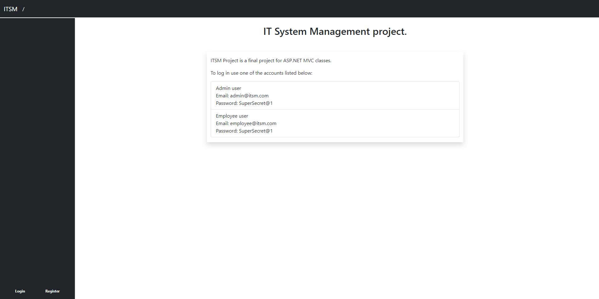

If you are logged you can see the kanban board.
Kanban board visualizes the work items that have been added to the database.
You can drag work items and move them to the relevant states.

For now we don't have any work items.

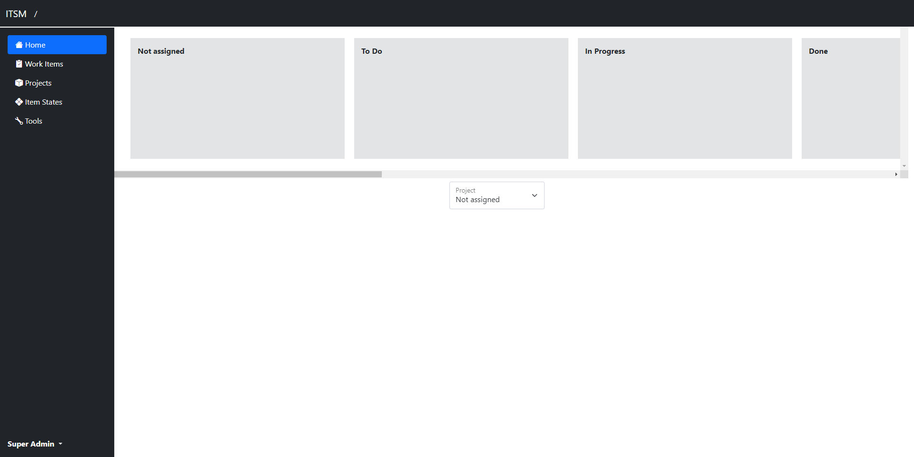

If you add any new work item you should see it here.

For example when creating this readme we created new project and new work item. Here is image of what it will look like:

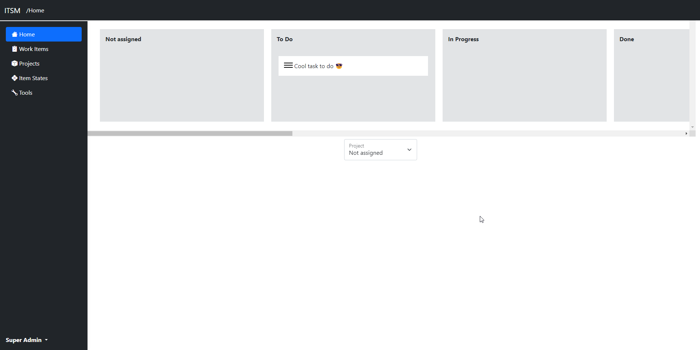

You can drag and drop tasks between states.

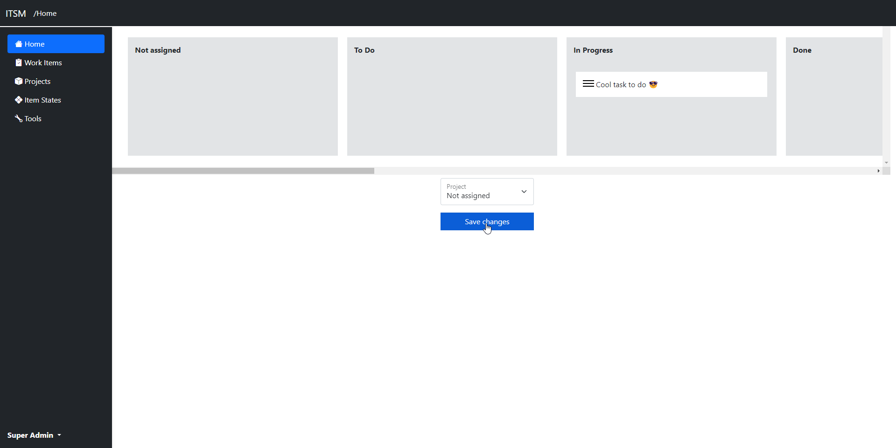

For now you work items unassigned to any project.
You can assign work item to the project, and change them in project's own canban.

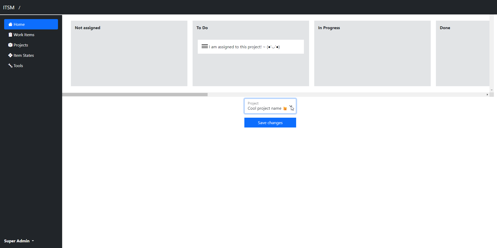

### Work Items

Work Item is a unit of work.

Work items are divided into three types: Task, Issue, and Epic.
Each type has its own use and its own characteristics.
'Task' has 'Remaning Work' field which shows how much work remains to complete a task, Issue has 'Effort' field which shows on a scale of 1 to 10 how much effort it takes to solve a problem, and Epic has its start date and end date.

If you just logged in you probably don't have any work item.

Let's add one!

Click Add, then click Task.

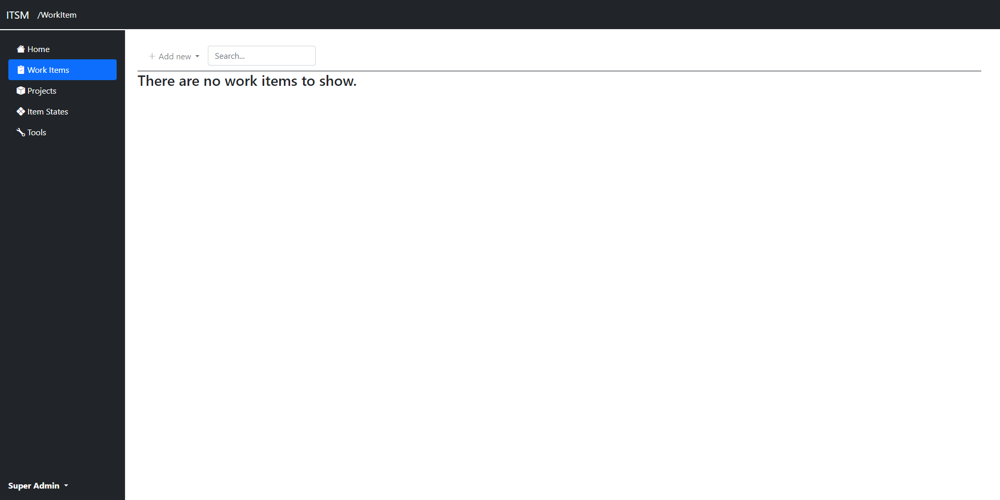

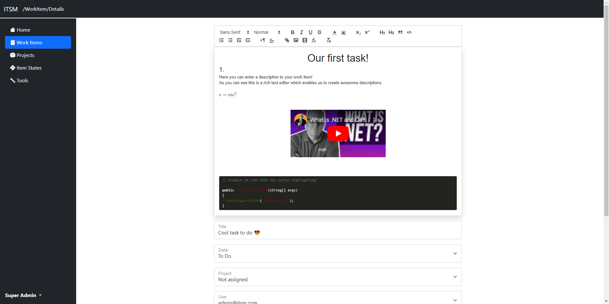

### Projects

Every project have its own description and assigned work items.
If we delete project, all of the assigned work items will be also deleted.

Let's create a new project!

Click Add new button.

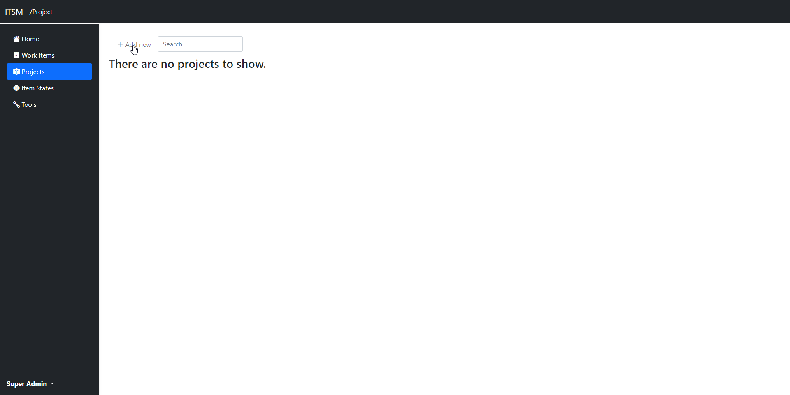

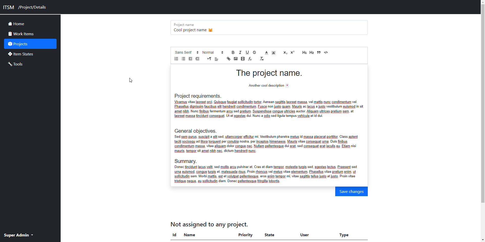

### States
State represents current condition that is assigned to the work item. Each state has its own description.

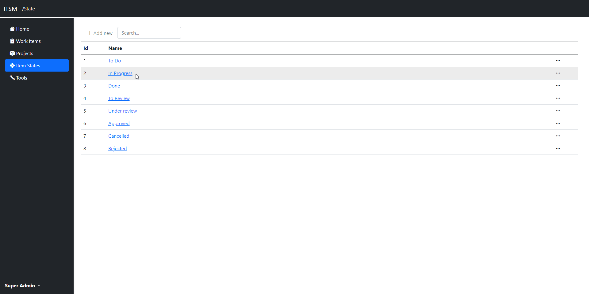

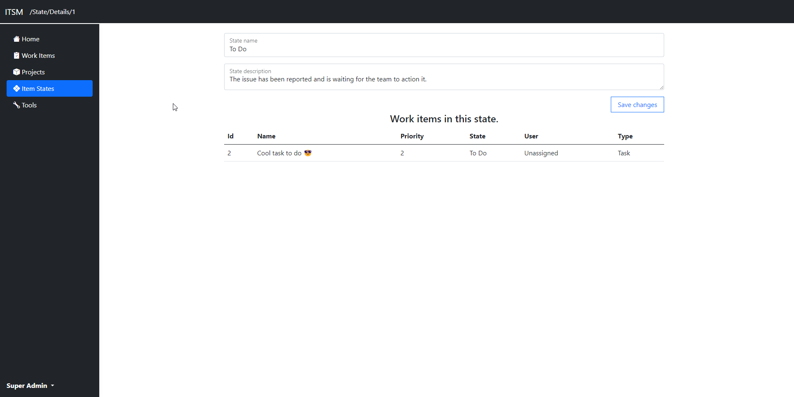

### Tools
If you are logged as an admin you can see special 'Tools' tab.

In this tab you have two options:

You can add new job positions to your company, so if you will register new employee he will get appropriate position.

You can register the new employee that will get emlpoyee role will get roles that allows to managing work items, and projects.

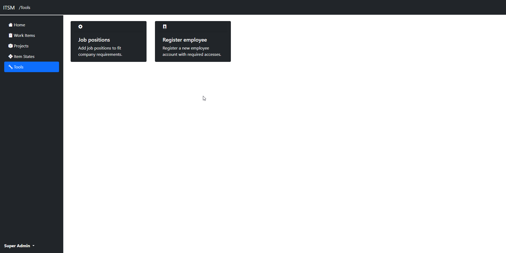

## Test users

### Admin user
    Email: admin@itsm.com
    Password: SuperSecret@1

### Employee user
    Email: employee@itsm.com
    Password: SuperSecret@1

## Login / Register
You can log in to an account / register using 'Login' or 'Register' button in the bottom left corner.
If you are trying to register please note that your password must meet the requirements.

## Built With

* [Asp.Net Core](https://learn.microsoft.com/en-us/aspnet/core/?view=aspnetcore-7.0)
* [Entity Framework Core](https://docs.microsoft.com/en-us/ef/core/)
* [SQLite](https://www.sqlite.org/index.html)

## Author

Jakub Miłek
